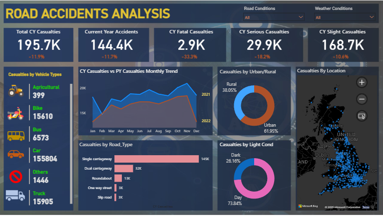
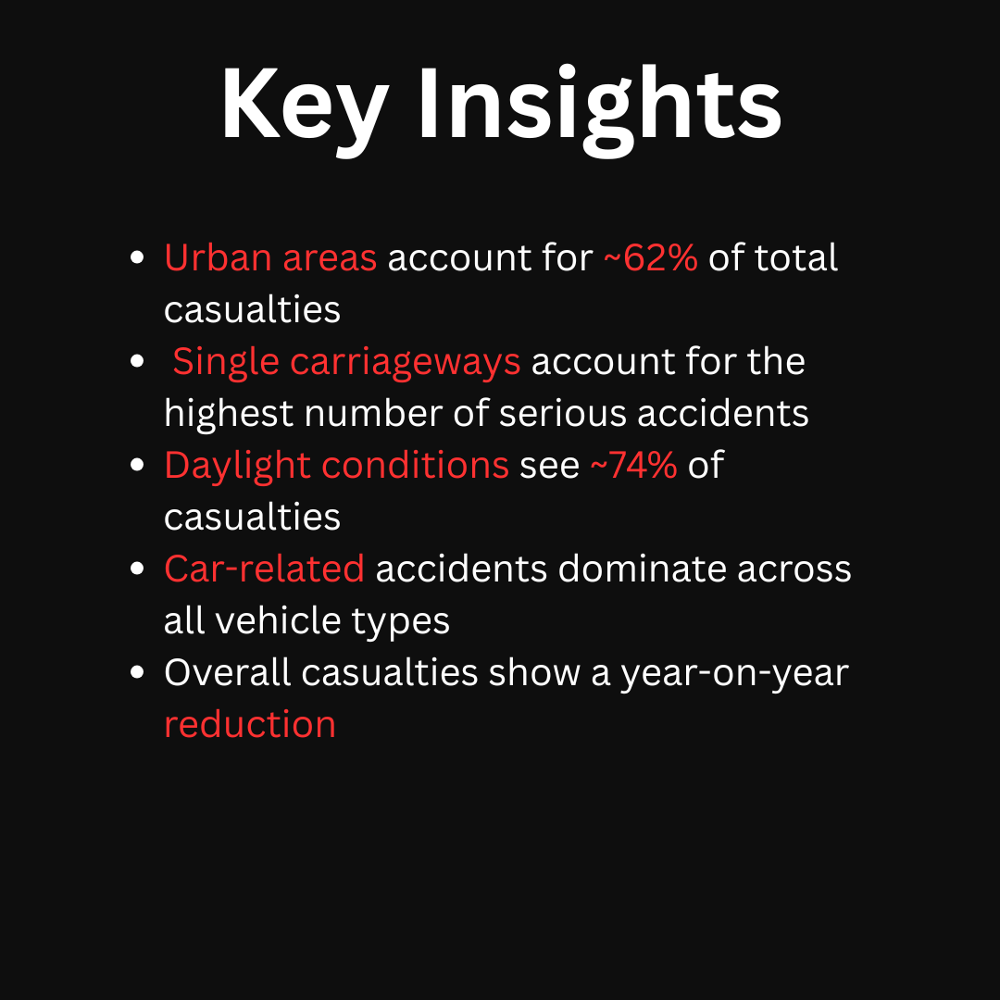

# Road Accidents Analysis Dashboard

## Overview
An interactive Power BI dashboard analysing road accident casualties to identify
patterns based on time, location, road conditions, and vehicle types.

## Tools Used
- Power BI Desktop
- SQL (data aggregation & analysis)
- Excel (data cleaning)

## Key Features
- Current Year vs Previous Year casualty comparison
- Severity-wise analysis (Fatal, Serious, Slight)
- Road type, light condition, and vehicle-based analysis
- Geospatial visualisation using maps

## Key Insights
- Urban areas account for the majority of casualties
- Single carriageways are the most accident-prone
- The majority of accidents occur during daylight conditions
- Overall casualties reduced compared to the previous year

## How to Use
1. Download the `.pbix` file
2. Open in Power BI Desktop
3. Refresh data if needed

## Dashboard Preview

## Key Insights

